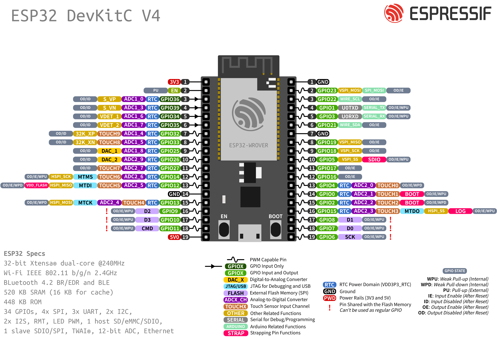

# Arduino core for the ESP32
 

### Need help or have a question? Join the chat at 

## Contents
- [Development Status](#development-status)
- [Installation Instructions](#installation-instructions)
- [Decoding Exceptions](#decoding-exceptions)
- [Issue/Bug report template](#issuebug-report-template)
- [ESP32Dev Board PINMAP](#esp32dev-board-pinmap)

### Development Status
[Latest stable release  ](https://github.com/espressif/arduino-esp32/releases/latest/) 

[Latest development release  ](https://github.com/espressif/arduino-esp32/releases/latest/) 

### Installation Instructions
- Using Arduino IDE Boards Manager (preferred)
  + [Instructions for Boards Manager](docs/arduino-ide/boards_manager.md)
- Using Arduino IDE with the development repository
  + [Instructions for Windows](docs/arduino-ide/windows.md)
  + [Instructions for Mac](docs/arduino-ide/mac.md)
  + [Instructions for Debian/Ubuntu Linux](docs/arduino-ide/debian_ubuntu.md)
  + [Instructions for Fedora](docs/arduino-ide/fedora.md)
  + [Instructions for openSUSE](docs/arduino-ide/opensuse.md)
- [Using PlatformIO](docs/platformio.md)
- [Building with make](docs/make.md)
- [Using as ESP-IDF component](docs/esp-idf_component.md)
- [Using OTAWebUpdater](docs/OTAWebUpdate/OTAWebUpdate.md)

### Decoding exceptions

You can use [EspExceptionDecoder](https://github.com/me-no-dev/EspExceptionDecoder) to get meaningful call trace.

### Issue/Bug report template
Before reporting an issue, make sure you've searched for similar one that was already created. Also make sure to go through all the issues labelled as [for reference](https://github.com/espressif/arduino-esp32/issues?utf8=%E2%9C%93&q=is%3Aissue%20label%3A%22for%20reference%22%20).

Finally, if you are sure no one else had the issue, follow the [ISSUE_TEMPLATE](docs/ISSUE_TEMPLATE.md) while reporting any issue.

### ESP32Dev Board PINMAP

### Tip

Sometimes to program ESP32 via serial you must keep GPIO0 LOW during the programming process
