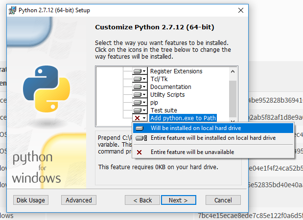
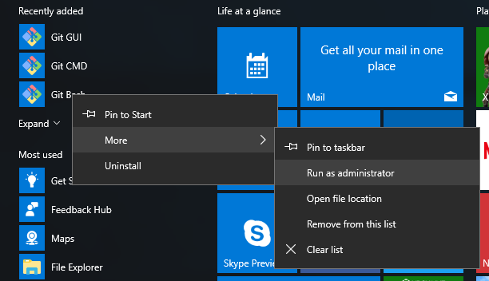
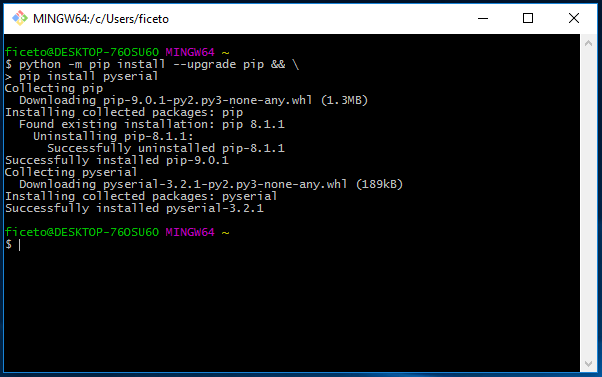
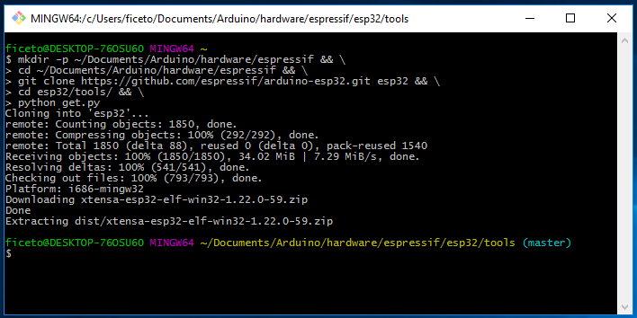

## Steps to install Arduino ESP32 support on Windows
### Tested on 32 and 64 bit Windows 10 machines

1. Download and install the latest Arduino IDE ```Windows Installer``` from [arduino.cc](https://www.arduino.cc/en/Main/Software)
2. Download ```Windows x86 MSI installer``` or ```Windows x86-64 MSI installer``` from [python.org](https://www.python.org/downloads/release/python-2712/). When installing:
    - Install for all users
    - In ```Customize Python 2.7.X``` page, make sure you enable the last option: ```Add python.exe to Path```
        
3. Download and install Git from [git-scm.com](https://git-scm.com/download/win)
4. Start ```Git Bash``` as Administrator and execute the following command

    ```bash
    python -m pip install --upgrade pip && \
    pip install pyserial
    ```
    
    
5. Start ```Git Bash``` normally and execute the following command

    ```bash
    mkdir -p ~/Documents/Arduino/hardware/espressif && \
    cd ~/Documents/Arduino/hardware/espressif && \
    git clone https://github.com/espressif/arduino-esp32.git esp32 && \
    cd esp32/tools/ && \
    python get.py
    ```
    
6. Plug your ESP32 board and wait for the drivers to install (or install manually any that might be required)
7. Start Arduino IDE
8. Select your board in ```Tools > Board``` menu
9. Select the COM port that the board is attached to
10. Compile and upload (You might need to hold the boot button while uploading)

    
