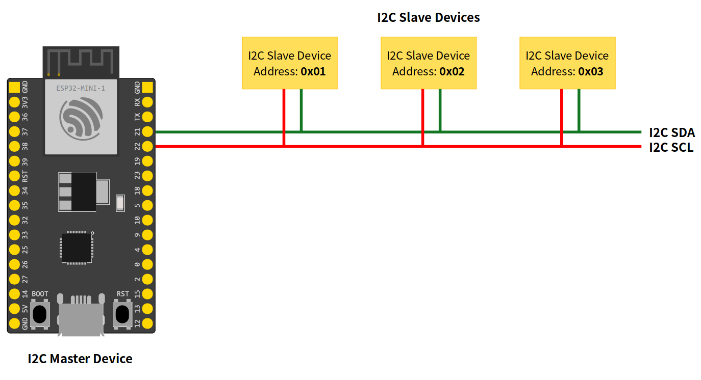
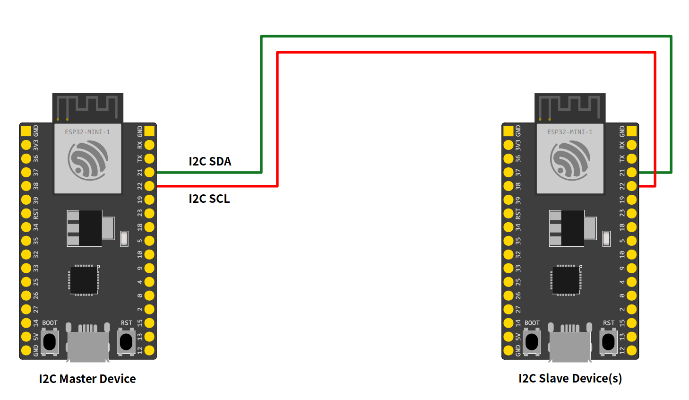

###
I2C
###

About
-----

I2C (Inter-Integrated Circuit) / TWI (Two-wire Interface) is a widely used serial communication to connect devices in a short distance. This is one of the most common peripherals used to connect sensors, EEPROMs, RTC, ADC, DAC, displays, OLED, and many other devices and microcontrollers.

This serial communication is considered as a low-speed bus, and multiple devices can be connected on the same two-wires bus, each with a unique 7-bits address (up to 128 devices). These two wires are called SDA (serial data line) and SCL (serial clock line).

.. note:: The SDA and SCL lines require pull-up resistors. See the device datasheet for more details about the resistors' values and the operating voltage.

I2C Modes
*********

The I2C can be used in two different modes:

* **I2C Master Mode**
    * In this mode, the ESP32 generates the clock signal and initiates the communication with the slave device.

* **I2C Slave Mode**
    * The slave mode, the clock is generated by the master device and responds to the master if the destination address is the same as the destination.

Arduino-ESP32 I2C API
---------------------

The ESP32 I2C library is based on the `Arduino Wire Library`_ and implements a few more APIs, described in this documentation.

I2C Common API
**************

Here are the common functions used for master and slave modes.

begin
^^^^^

This function is used to start the peripheral using the default configuration.

.. code-block:: arduino

    bool begin();

This function will return ``true`` if the peripheral was initialized correctly.

setPins
^^^^^^^

This function is used to define the ``SDA`` and ``SCL`` pins.

.. note:: Call this function before ``begin`` to change the pins from the default ones.

.. code-block:: arduino

    bool setPins(int sdaPin, int sclPin);

* ``sdaPin`` sets the GPIO to be used as the I2C peripheral data line.

* ``sclPin`` sets the GPIO to be used as the I2C peripheral clock line.

The default pins may vary from board to board. On the *Generic ESP32* the default I2C pins are:

* ``sdaPin`` **GPIO21**

* ``sclPin`` **GPIO22**

This function will return ``true`` if the peripheral was configured correctly.

setClock
^^^^^^^^

Use this function to set the bus clock. The default value will be used if this function is not used.

.. code-block:: arduino

    bool setClock(uint32_t frequency);

* ``frequency`` sets the bus frequency clock.

This function will return ``true`` if the clock was configured correctly.

getClock
^^^^^^^^

Use this function to get the bus clock.

.. code-block:: arduino

    uint32_t getClock();

This function will return the current frequency configuration.

setTimeOut
^^^^^^^^^^

Set the bus timeout given in milliseconds. The default value is 50 ms.

.. code-block:: arduino

    void setTimeOut(uint16_t timeOutMillis);

* ``timeOutMillis`` sets the timeout in ms.

getTimeOut
^^^^^^^^^^

Get the bus timeout in milliseconds.

.. code-block:: arduino

    uint16_t getTimeOut();

This function will return the current timeout configuration.

.. _i2c write:

write
^^^^^

This function writes data to the buffer.

.. code-block:: arduino

    size_t write(uint8_t);

or

.. code-block:: arduino

    size_t write(const uint8_t *, size_t);

The return will be the size of the data added to the buffer.

.. _i2c end:

end
^^^

This function will finish the communication and release all the allocated resources. After calling ``end`` you need to use ``begin`` again in order to initialize the I2C driver again.

.. code-block:: arduino

    bool end();

I2C Master Mode
***************

This mode is used to initiate communication to the slave.

Basic Usage
^^^^^^^^^^^

To start using I2C master mode on the Arduino, the first step is to include the ``Wire.h`` header to the sketch.

.. code-block:: arduino

    #include "Wire.h"

Now, we can start the peripheral configuration by calling ``begin`` function.

.. code-block:: arduino

    Wire.begin();

By using ``begin`` without any arguments, all the settings will be done by using the default values. To set the values by your own, see the function description. This function is described here: `i2c begin`_

After calling ``begin``, we can start the transmission by calling ``beginTransmission`` and passing the I2C slave address:

.. code-block:: arduino

    Wire.beginTransmission(I2C_DEV_ADDR);

To write some bytes to the slave, use the ``write`` function.

.. code-block:: arduino

    Wire.write(x);

You can pass different data types using ``write`` function. This function is described here: `i2c write`_

.. note:: The ``write`` function does not write directly to the slave device but adds to the I2C buffer. To do so, you need to use the ``endTransmission`` function to send the buffered bytes to the slave device.

.. code-block:: arduino

    Wire.endTransmission(true);

After calling ``endTransmission``, the data stored in the I2C buffer will be transmitted to the slave device.

Now you can request a reading from the slave device. The ``requestFrom`` will ask for a readout to the selected device by giving the address and the size.

.. code-block:: arduino

    Wire.requestFrom(I2C_DEV_ADDR, SIZE);

and the ``readBytes`` will read it.

.. code-block:: arduino

    Wire.readBytes(temp, error);

.. _i2c begin:

I2C Master APIs
***************

Here are the I2C master APIs. These function are intended to be used only for master mode.

begin
^^^^^

In master mode, the ``begin`` function can be used by passing the **pins** and **bus frequency**. Use this function only for the master mode.

.. code-block:: arduino

    bool begin(int sdaPin, int sclPin, uint32_t frequency)

Alternatively, you can use the ``begin`` function without any argument to use all default values.

This function will return ``true`` if the peripheral was initialized correctly.

beginTransmission
^^^^^^^^^^^^^^^^^

This function is used to star a communication process with the slave device. Call this function by passing the slave ``address`` before writing the message to the buffer.

.. code-block:: arduino

    void beginTransmission(uint16_t address)

endTransmission
^^^^^^^^^^^^^^^

After writing to the buffer using `i2c write`_, use the function ``endTransmission`` to send the message to the slave device address defined on the ``beginTransmission`` function.

.. code-block:: arduino

    uint8_t endTransmission(bool sendStop);

* ``sendStop`` enables **(true)** or disables **(false)** the stop signal *(only used in master mode)*.

Calling the this function without ``sendStop`` is equivalent to ``sendStop = true``.

.. code-block:: arduino

    uint8_t endTransmission(void);

This function will return the error code.

requestFrom
^^^^^^^^^^^

To read from the slave device, use the ``requestFrom`` function.

.. code-block:: arduino

    uint8_t requestFrom(uint16_t address, uint8_t size, bool sendStop)

* ``address`` set the device address.

* ``size`` define the size to be requested.

* ``sendStop`` enables (true) or disables (false) the stop signal.

This function will return the number of bytes read from the device.

Example Application - WireMaster.ino
^^^^^^^^^^^^^^^^^^^^^^^^^^^^^^^^^^^^

Here is an example of how to use the I2C in Master Mode.

.. literalinclude:: ../../../libraries/Wire/examples/WireMaster/WireMaster.ino
    :language: arduino

I2C Slave Mode
**************

This mode is used to accept communication from the master.

Basic Usage
^^^^^^^^^^^

To start using I2C as slave mode on the Arduino, the first step is to include the ``Wire.h`` header to the sketch.

.. code-block:: arduino

    #include "Wire.h"

Before calling ``begin`` we must create two callback functions to handle the communication with the master device.

.. code-block:: arduino

    Wire.onReceive(onReceive);

and

.. code-block:: arduino

    Wire.onRequest(onRequest);

The ``onReceive`` will handle the request from the master device upon a slave read request and the ``onRequest`` will handle the answer to the master.

Now, we can start the peripheral configuration by calling ``begin`` function with the device address.

.. code-block:: arduino

    Wire.begin((uint8_t)I2C_DEV_ADDR);

By using ``begin`` without any arguments, all the settings will be done by using the default values. To set the values by your own, see the function description. This function is described here: `i2c begin`_

**For ESP32 only!**

Use the function ``slaveWrite`` in order to pre-write to the slave response buffer. This is used only for the ESP32 in order to add the slave capability on the chip and keep compatibility with Arduino.

.. code-block:: arduino

    Wire.slaveWrite((uint8_t *)message, strlen(message));

I2C Slave APIs
**************

Here are the I2C slave APIs. These function are intended to be used only for slave mode.

begin
^^^^^

In slave mode, the ``begin`` function must be used by passing the **slave address**. You can also define the **pins** and the **bus frequency**.

.. code-block:: arduino

    bool Wire.begin(uint8_t addr, int sdaPin, int sclPin, uint32_t frequency)

This function will return ``true`` if the peripheral was initialized correctly.

onReceive
^^^^^^^^^

The ``onReceive`` function is used to define the callback for data received from the master device.

.. code-block:: arduino

    void onReceive(const std::function<void(int)>& callback);

**Function Signature:**

The callback function must have the signature ``void(int numBytes)`` where ``numBytes`` indicates how many bytes were received from the master.

**Usage Examples:**

.. code-block:: arduino

    // Method 1: Regular function
    void handleReceive(int numBytes) {
        Serial.printf("Received %d bytes: ", numBytes);
        while (Wire.available()) {
            char c = Wire.read();
            Serial.print(c);
        }
        Serial.println();
    }
    Wire.onReceive(handleReceive);

    // Method 2: Lambda function
    Wire.onReceive( {
        Serial.printf("Master sent %d bytes\n", numBytes);
        while (Wire.available()) {
            uint8_t data = Wire.read();
            // Process received data
            Serial.printf("Data: 0x%02X\n", data);
        }
    });

    // Method 3: Lambda with capture (for accessing variables)
    int deviceId = 42;
    Wire.onReceive([deviceId](int numBytes) {
        Serial.printf("Device %d received %d bytes\n", deviceId, numBytes);
        // Process data...
    });

    // Method 4: Using std::function variable
    std::function<void(int)> receiveHandler =  {
        Serial.printf("Handling %d received bytes\n", bytes);
    };
    Wire.onReceive(receiveHandler);

    // Method 5: Class member function (using lambda wrapper)
    class I2CDevice {
    private:
        int deviceAddress;
    public:
        I2CDevice(int addr) : deviceAddress(addr) {}

        void handleReceive(int numBytes) {
            Serial.printf("Device 0x%02X received %d bytes\n", deviceAddress, numBytes);
        }

        void setup() {
            Wire.onReceive([this](int bytes) {
                this->handleReceive(bytes);
            });
        }
    };

.. note::
    The ``onReceive`` callback is triggered when the I2C master sends data to this slave device.
    Use ``Wire.available()`` and ``Wire.read()`` inside the callback to retrieve the received data.

onRequest
^^^^^^^^^

The ``onRequest`` function is used to define the callback for responding to master read requests.

.. code-block:: arduino

    void onRequest(const std::function<void()>& callback);

**Function Signature:**

The callback function must have the signature ``void()`` with no parameters. This callback is triggered when the master requests data from this slave device.

**Usage Examples:**

.. code-block:: arduino

    // Method 1: Regular function
    void handleRequest() {
        static int counter = 0;
        Wire.printf("Response #%d", counter++);
    }
    Wire.onRequest(handleRequest);

    // Method 2: Lambda function
    Wire.onRequest( {
        // Send sensor data to master
        int sensorValue = analogRead(A0);
        Wire.write(sensorValue >> 8);    // High byte
        Wire.write(sensorValue & 0xFF);  // Low byte
    });

    // Method 3: Lambda with capture (for accessing variables)
    int deviceStatus = 1;
    String deviceName = "Sensor1";
    Wire.onRequest([&deviceStatus, &deviceName]() {
        Wire.write(deviceStatus);
        Wire.write(deviceName.c_str(), deviceName.length());
    });

    // Method 4: Using std::function variable
    std::function<void()> requestHandler =  {
        Wire.write("Hello Master!");
    };
    Wire.onRequest(requestHandler);

    // Method 5: Class member function (using lambda wrapper)
    class TemperatureSensor {
    private:
        float temperature;
    public:
        void updateTemperature() {
            temperature = 25.5; // Read from actual sensor
        }

        void sendTemperature() {
            // Convert float to bytes and send
            uint8_t* tempBytes = (uint8_t*)&temperature;
            Wire.write(tempBytes, sizeof(float));
        }

        void setup() {
            Wire.onRequest([this]() {
                this->sendTemperature();
            });
        }
    };

.. note::
    The ``onRequest`` callback is triggered when the I2C master requests data from this slave device.
    Use ``Wire.write()`` inside the callback to send response data back to the master.

slaveWrite
^^^^^^^^^^

The ``slaveWrite`` function writes on the slave response buffer before receiving the response message. This function is only used for adding the slave compatibility for the ESP32.

.. warning:: This function is only required for the ESP32. You **don't** need to use for ESP32-S2 and ESP32-C3.

.. code-block:: arduino

    size_t slaveWrite(const uint8_t *, size_t);

Example Application - WireSlave.ino
^^^^^^^^^^^^^^^^^^^^^^^^^^^^^^^^^^^

Here is an example of how to use the I2C in Slave Mode.

.. literalinclude:: ../../../libraries/Wire/examples/WireSlave/WireSlave.ino
    :language: arduino

.. _Arduino Wire Library: https://www.arduino.cc/en/reference/wire
