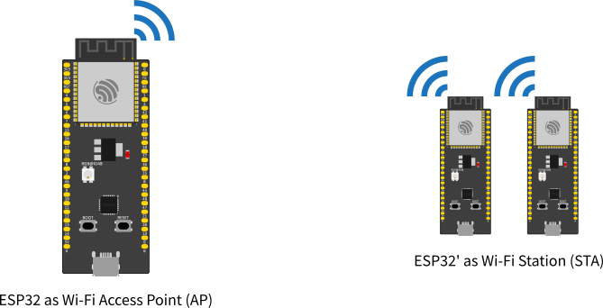
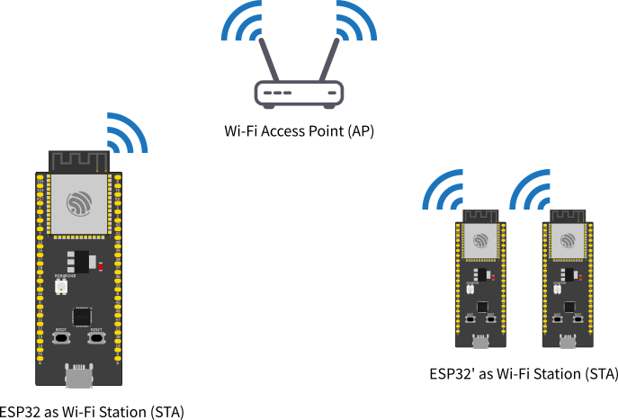

#########
Wi-Fi API
#########

About
-----

The Wi-Fi API provides support for the 802.11b/g/n protocol driver. This API includes:

* Station mode (STA mode or Wi-Fi client mode). ESP32 connects to an access point

* AP mode (aka Soft-AP mode or Access Point mode). Devices connect to the ESP32

* Security modes (WPA2, WPA3 etc.)

* Scanning for access points

Working as AP
*************

In this mode, the ESP32 is configured as an Access Point (AP) and it's capable of receiving incoming connections from other devices (stations) by providing
a Wi-Fi network.

This mode can be used for serving an HTTP or HTTPS server inside the ESP32, for example.

Working as STA
**************

The STA mode is used to connect the ESP32 to a Wi-Fi network, provided by an Access Point.

This is the mode to be used if you want to connect your project to the Internet.

API Description
---------------

Here is the description of the WiFi API.

Common API
----------

Here are the common APIs that are used for both modes, AP and STA.

onEvent (and removeEvent)
*************************

Registers a caller-supplied function to be called when WiFi events
occur. Several forms are available.

Function pointer callback taking the event ID:

.. code-block:: arduino

    typedef void (*WiFiEventCb)(arduino_event_id_t);
    wifi_event_id_t onEvent(WiFiEventCb, arduino_event_id_t = ARDUINO_EVENT_MAX);

Function pointer callback taking an event-ID-and-info struct:

.. code-block:: arduino

    typedef struct{
        arduino_event_id_t event_id;
        arduino_event_info_t event_info;
    } arduino_event_t;

    typedef void (*WiFiEventSysCb)(arduino_event_t *);
    wifi_event_id_t onEvent(WiFiEventSysCb, arduino_event_id_t = ARDUINO_EVENT_MAX);

Callback using ``std::function`` taking event ID and info separately:

.. code-block:: arduino

    typedef std::function<void(arduino_event_id_t, arduino_event_info_t)> WiFiEventFuncCb;
    wifi_event_id_t onEvent(WiFiEventFuncCb, arduino_event_id_t = ARDUINO_EVENT_MAX);

A similar set of functions are available to remove callbacks:

.. code-block:: arduino

    void removeEvent(WiFiEventCb, arduino_event_id_t = ARDUINO_EVENT_MAX);
    void removeEvent(WiFiEventSysCb, arduino_event_id_t = ARDUINO_EVENT_MAX);
    void removeEvent(wifi_event_id_t = ARDUINO_EVENT_MAX);

In all cases, the subscribing function accepts an optional event type to
invoke the callback only for that specific event; with the default
``ARDUINO_EVENT_MAX``, the callback will be invoked for all WiFi events.

Any callback function is given the event type in a parameter.
Some of the possible callback function formats also take an
``arduino_event_info_t`` (or use ``arduino_event_t`` which includes both
ID and info) which is a union of structs with additional information
about different event types.

See
`WiFiGeneric.h <https://github.com/espressif/arduino-esp32/blob/master/libraries/WiFi/src/WiFiGeneric.h>`_
for the list of event types and "info" substructures, and also see a full
example of event handling: `events example`_.

.. warning::

    Event callback functions are invoked on a separate
    `thread <https://en.wikipedia.org/wiki/Thread_(computing)>`_
    (`FreeRTOS task <https://docs.espressif.com/projects/esp-idf/en/latest/esp32/api-reference/system/freertos_idf.html#tasks>`_)
    independent of the main application thread that runs ``setup()`` and
    ``loop()``. Callback functions must therefore be
    `thread-safe <https://en.wikipedia.org/wiki/Thread_safety>`_;
    they must not access shared/global variables directly without locking,
    and must only call similarly thread-safe functions.

    Some core operations like ``Serial.print()`` are thread-safe but many
    functions are not. Notably, ``WiFi.onEvent()`` and ``WiFi.removeEvent()``
    are not thread-safe and should never be invoked from a callback thread.

setHostname (and getHostname)
*****************************

Sets the name the DHCP client uses to identify itself. In a typical network
setup this will be the name that shows up in the Wi-Fi router's device list.
The hostname must be no longer than 32 characters.

.. code-block:: arduino

    setHostname(const char *hostname);

If the hostname is never specified, a default one will be assigned based
on the chip type and MAC address. The current hostname (default or custom)
may be retrieved:

.. code-block:: arduino

    const char *getHostname();

.. warning::

    The ``setHostname()`` function must be called BEFORE WiFi is started with
    ``WiFi.begin()``, ``WiFi.softAP()``, ``WiFi.mode()``, or ``WiFi.run()``.
    To change the name, reset WiFi with ``WiFi.mode(WIFI_MODE_NULL)``,
    then proceed with ``WiFi.setHostname(...)`` and restart WiFi from scratch.

useStaticBuffers
****************

This function is used to set the memory allocation mode for the Wi-Fi buffers.

.. code-block:: arduino

    static void useStaticBuffers(bool bufferMode);

* Set ``true`` to use the Wi-Fi buffers memory allocation as **static**.
* Set ``false`` to set the buffers memory allocation to **dynamic**.

The use of dynamic allocation is recommended to save memory and reduce resources usage. However, the dynamic performs slightly slower than the static allocation.
Use static allocation if you want to have more performance and if your application is multi-tasking.

By default, the memory allocation will be set to **dynamic** if this function is not being used.

setDualAntennaConfig
********************

Configures the Dual antenna functionality. This function should be used only on the **ESP32-WROOM-DA** module or any other ESP32 with RF switch.

.. code-block:: arduino

    bool setDualAntennaConfig(uint8_t gpio_ant1, uint8_t gpio_ant2, wifi_rx_ant_t rx_mode, wifi_tx_ant_t tx_mode);

* ``gpio_ant1`` Configure the GPIO number for the antenna 1 connected to the RF switch (default ``GPIO2`` on ESP32-WROOM-DA)
* ``gpio_ant2`` Configure the GPIO number for the antenna 2 connected to the RF switch (default ``GPIO25`` on ESP32-WROOM-DA)
* ``rx_mode`` Set the RX antenna mode. See wifi_rx_ant_t for the options.
* ``tx_mode`` Set the TX antenna mode. See wifi_tx_ant_t for the options.

Return ``true`` if the configuration was successful.

For the ``rx_mode`` you can use the following configuration:

* ``WIFI_RX_ANT0`` Selects the antenna 1 for all RX activity.
* ``WIFI_RX_ANT1`` Selects the antenna 2 for all RX activity.
* ``WIFI_RX_ANT_AUTO``  Selects the antenna for RX automatically.

For the ``tx_mode`` you can use the following configuration:

* ``WIFI_TX_ANT0`` Selects the antenna 1 for all TX activity.
* ``WIFI_TX_ANT1`` Selects the antenna 2 for all TX activity.
* ``WIFI_TX_ANT_AUTO`` Selects the antenna for TX automatically.

WiFiAP
------

The ``WiFiAP`` is used to configure and manage the Wi-Fi as an Access Point. This is where you can find the related functions for the AP.

Basic Usage
***********

To start the Wi-Fi as an Access Point.

.. code-block:: arduino

    WiFi.softAP(ssid, password);

Please see the full WiFiAP example in: `ap example`_.

AP Configuration
----------------

softAP
******

Use the function ``softAP`` to configure the Wi-Fi AP characteristics:

.. code-block:: arduino

    bool softAP(const char* ssid, const char* passphrase = NULL, int channel = 1, int ssid_hidden = 0, int max_connection = 4, bool ftm_responder = false);

Where:

* ``ssid`` sets the Wi-Fi network SSID.
* ``passphrase`` sets the Wi-Fi network password. If the network is open, set as ``NULL``.
* ``channel`` configures the Wi-Fi channel.
* ``ssid_hidden`` sets the network as hidden.
* ``max_connection`` sets the maximum number of simultaneous connections. The default is 4.
* ``ftm_responder`` sets the Wi-Fi FTM responder feature. **Only for ESP32-S2 and ESP32-C3 SoC!**

Return ``true`` if the configuration was successful.

softAPConfig
************

Function used to configure the IP as static (fixed) as well as the gateway and subnet.

.. code-block:: arduino

    bool softAPConfig(IPAddress local_ip, IPAddress gateway, IPAddress subnet);

Where:

* ``local_ip`` sets the local IP address.
* ``gateway`` sets the gateway IP.
* ``subnet`` sets the subnet mask.

The function will return ``true`` if the configuration is successful.

AP Connection
-------------

softAPdisconnect
****************

Function used to force the AP disconnection.

.. code-block:: arduino

    bool softAPdisconnect(bool wifioff = false);

Where:

* ``wifioff`` sets the Wi-Fi off if ``true``.

The function will return ``true`` if the configuration is successful.

softAPgetStationNum
*******************

This function returns the number of clients connected to the AP.

.. code-block:: arduino

    uint8_t softAPgetStationNum();

softAPIP
********

Function to get the AP IPv4 address.

.. code-block:: arduino

    IPAddress softAPIP();

The function will return the AP IP address in ``IPAddress`` format.

softAPBroadcastIP
*****************

Function to get the AP IPv4 broadcast address.

.. code-block:: arduino

    IPAddress softAPBroadcastIP();

The function will return the AP broadcast address in ``IPAddress`` format.

softAPNetworkID
***************

Get the softAP network ID.

.. code-block:: arduino

    IPAddress softAPNetworkID();

The function will return the AP network address in ``IPAddress`` format.

softAPSubnetCIDR
****************

Get the softAP subnet CIDR.

.. code-block:: arduino

    uint8_t softAPSubnetCIDR();

softAPSubnetMask
****************

Get the softAP subnet mask.

.. code-block:: arduino

    IPAddress softAPSubnetMask();

softAPenableIPv6
****************

Function used to enable the IPv6 support.

.. code-block:: arduino

    bool softAPenableIPv6(bool enable=true);

The function will return ``true`` if the configuration is successful.

softAPIPv6
**********

Function to get the IPv6 address.

.. code-block:: arduino

    IPAddress softAPlinkLocalIPv6();

The function will return the AP IPv6 address in ``IPAddress`` format.

softAPgetHostname
*****************

Function to get the AP hostname.

.. code-block:: arduino

    const char * softAPgetHostname();

softAPsetHostname
*****************

Function to set the AP hostname.

.. code-block:: arduino

    bool softAPsetHostname(const char * hostname);

Where:

* ``hostname`` sets the device hostname.

The function will return ``true`` if the configuration is successful.

softAPmacAddress
****************

Function to define the AP MAC address.

.. code-block:: arduino

    uint8_t* softAPmacAddress(uint8_t* mac);

Where:

* ``mac`` sets the new MAC address.

Function to get the AP MAC address.

.. code-block:: arduino

    String softAPmacAddress(void);

softAPSSID
**********

Function to get the AP SSID.

.. code-block:: arduino

    String softAPSSID(void) const;

Returns the AP SSID.

WiFiSTA
-------

The ``WiFiSTA`` is used to configure and manage the Wi-Fi as Station. The related functions for the STA are here.

Basic Usage
***********

The following code shows the basic usage of the WifiSTA functionality.

.. code-block:: arduino

    WiFi.begin(ssid, password);

Where the ``ssid`` and ``password`` are from the network you want to connect the ESP32.

To check if the connection is successful, you can use:

.. code-block:: arduino

    while (WiFi.status() != WL_CONNECTED) {
        delay(500);
        Serial.print(".");
    }

After a successful connection, you can print the IP address given by the network.

.. code-block:: arduino

    Serial.println("IP address: ");
    Serial.println(WiFi.localIP());

Please see the full example of the WiFiSTA in: `sta example`_.

STA Configuration
-----------------

begin
*****

- Functions ``begin`` are used to configure and start the Wi-Fi.

.. code-block:: arduino

    wl_status_t begin(const char* ssid, const char *passphrase = NULL, int32_t channel = 0, const uint8_t* bssid = NULL, bool connect = true);

Where:

* ``ssid`` sets the AP SSID.
* ``passphrase`` sets the AP password. Set as ``NULL`` for open networks.
* ``channel`` sets the Wi-Fi channel.
* ``uint8_t* bssid`` sets the AP BSSID.
* ``connect`` sets ``true`` to connect to the configured network automatically.

.. code-block:: arduino

    wl_status_t begin(char* ssid, char *passphrase = NULL, int32_t channel = 0, const uint8_t* bssid = NULL, bool connect = true);

Where:

* ``ssid`` sets the AP SSID.
* ``passphrase`` sets the AP password. Set as ``NULL`` for open networks.
* ``channel`` sets the Wi-Fi channel.
* ``bssid`` sets the AP BSSID.
* ``connect`` sets ``true`` to connect to the configured network automatically.

Function to start the connection after being configured.

.. code-block:: arduino

    wl_status_t begin();

config
******

Function ``config`` is used to configure Wi-Fi. After configuring, you can call function ``begin`` to start the Wi-Fi process.

.. code-block:: arduino

    bool config(IPAddress local_ip, IPAddress gateway, IPAddress subnet, IPAddress dns1 = (uint32_t)0x00000000, IPAddress dns2 = (uint32_t)0x00000000);

Where:

* ``local_ip`` sets the local IP.
* ``gateway`` sets the gateway IP.
* ``subnet`` sets the subnet mask.
* ``dns1`` sets the DNS.
* ``dns2`` sets the DNS alternative option.

The function will return ``true`` if the configuration is successful.

The ``IPAddress`` format is defined by 4 bytes as described here:

.. code-block:: arduino

    IPAddress(uint8_t first_octet, uint8_t second_octet, uint8_t third_octet, uint8_t fourth_octet);

Example:

.. code-block:: arduino

    IPAddress local_ip(192, 168, 10, 20);

See the ``WiFiClientStaticIP.ino`` for more details on how to use this feature.

STA Connection
--------------

reconnect
*********

Function used to reconnect the Wi-Fi connection.

.. code-block:: arduino

    bool reconnect();

disconnect
**********

Function to force disconnection.

.. code-block:: arduino

    bool disconnect(bool wifioff = false, bool eraseap = false);

Where:

* ``wifioff`` use ``true`` to turn the Wi-Fi radio off.
* ``eraseap`` use ``true`` to erase the AP configuration from the NVS memory.

The function will return ``true`` if the configuration is successful.

isConnected
***********

Function used to get the connection state.

.. code-block:: arduino

    bool isConnected();

Return the connection state.

setAutoConnect
**************

Function is deprecated.

getAutoConnect
**************

Function is deprecated.

setAutoReconnect
****************

Function used to set the automatic reconnection if the connection is lost.

.. code-block:: arduino

    bool setAutoReconnect(bool autoReconnect);

Where:

* ``autoConnect`` is set to ``true`` to enable this option.

getAutoReconnect
****************

Function used to get the automatic reconnection if the connection is lost.

.. code-block:: arduino

    bool getAutoReconnect();

The function will return ``true`` if this setting is enabled.

setMinSecurity
**************

Function used to set the minimum security for AP to be considered connectable.

.. code-block:: arduino

    bool setMinSecurity(wifi_auth_mode_t minSecurity);

Where:

* ``minSecurity`` is the minimum security for AP to be considered connectable. Default is ``WIFI_AUTH_WPA2_PSK``.

WiFiMulti
---------

The ``WiFiMulti`` allows you to add more than one option for the AP connection while running as a station.

To add the AP, use the following function. You can add multiple AP's and this library will handle the connection.

.. code-block:: arduino

    bool addAP(const char* ssid, const char *passphrase = NULL);

After adding the AP's, run by the following function.

.. code-block:: arduino

    uint8_t run(uint32_t connectTimeout=5000);

To see how to use the ``WiFiMulti``, take a look at the ``WiFiMulti.ino`` example available.

WiFiScan
--------

To perform the Wi-Fi scan for networks, you can use the following functions:

Start scan WiFi networks available.

.. code-block:: arduino

    int16_t scanNetworks(bool async = false, bool show_hidden = false, bool passive = false, uint32_t max_ms_per_chan = 300, uint8_t channel = 0);

Called to get the scan state in Async mode.

.. code-block:: arduino

    int16_t scanComplete();

Delete last scan result from RAM.

.. code-block:: arduino

    void scanDelete();

Loads all infos from a scanned wifi in to the ptr parameters.

.. code-block:: arduino

    bool getNetworkInfo(uint8_t networkItem, String &ssid, uint8_t &encryptionType, int32_t &RSSI, uint8_t* &BSSID, int32_t &channel);

To see how to use the ``WiFiScan``, take a look at the ``WiFiScan.ino`` or ``WiFiScanAsync.ino`` example available.

Examples
--------

`Complete list of WiFi examples <https://github.com/espressif/arduino-esp32/tree/master/libraries/WiFi/examples>`_.

.. _ap example:

Wi-Fi AP Example
****************

.. literalinclude:: ../../../libraries/WiFi/examples/WiFiAccessPoint/WiFiAccessPoint.ino
    :language: arduino

.. _sta example:

Wi-Fi STA Example
*****************

.. literalinclude:: ../../../libraries/WiFi/examples/WiFiClient/WiFiClient.ino
    :language: arduino

.. _events example:

Wi-Fi Events Example
********************

.. literalinclude:: ../../../libraries/WiFi/examples/WiFiClientEvents/WiFiClientEvents.ino
    :language: arduino
