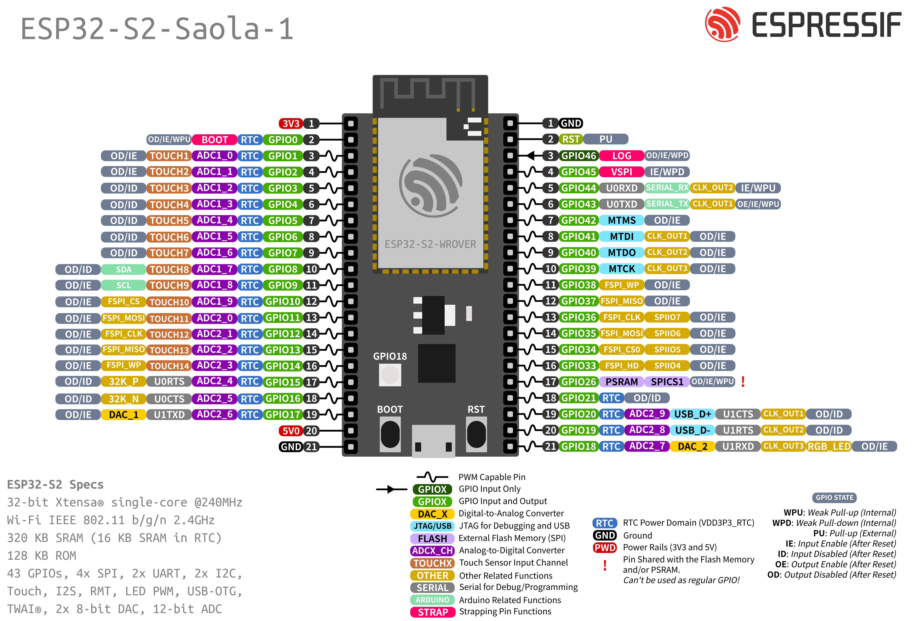

################
ESP32-S2-Saola-1
################

The `ESP32-S2-Saola-1`_ development board is one of Espressif's official boards. This board is based on the `ESP32-S2-WROVER`_ module, with the `ESP32-S2`_ as the core.

Specifications
--------------

- Wi-Fi 802.11b/g/n (802.11n up to 150 Mbps)
- Built around ESP32-S2 series of SoCs Xtensa® single-core
- Integrated 4 MB SPI flash
- Integrated 2 MB PSRAM
- Peripherals
    - 43 × programmable GPIOs
    - 2 × 13-bit SAR ADCs, up to 20 channels
    - 2 × 8-bit DAC
    - 14 × touch sensing IOs
    - 4 × SPI
    - 1 × I2S
    - 2 × I2C
    - 2 × UART
    - RMT (TX/RX)
    - LED PWM controller, up to 8 channels
    - 1 × full-speed USB OTG
    - 1 × temperature sensor
    - 1 × DVP 8/16 camera interface, implemented using the hardware resources of I2S
    - 1 × LCD interface (8-bit serial RGB/8080/6800), implemented using the hardware resources of SPI2
    - 1 × LCD interface (8/16/24-bit parallel), implemented using the hardware resources of I2S
    - 1 × TWAI® controller (compatible with ISO 11898-1)
- PCB antenna or external antenna connector

Header Block
------------

.. note::
    Not all of the chip pins are exposed to the pin headers.

J2
^^^

.. vale off

===  ====  =====  ===================================
No.  Name  Type   Function
===  ====  =====  ===================================
1    3V3   P      3.3 V power supply
2    IO0   I/O    GPIO0, Boot
3    IO1   I/O    GPIO1, ADC1_CH0, TOUCH_CH1
4    IO2   I/O    GPIO2, ADC1_CH1, TOUCH_CH2
5    IO3   I/O    GPIO3, ADC1_CH2, TOUCH_CH3
6    IO4   I/O    GPIO4, ADC1_CH3, TOUCH_CH4
7    IO5   I/O    GPIO5, ADC1_CH4, TOUCH_CH5
8    IO6   I/O    GPIO6, ADC1_CH5, TOUCH_CH6
9    IO7   I/O    GPIO7, ADC1_CH6, TOUCH_CH7
10   IO8   I/O    GPIO8, ADC1_CH7, TOUCH_CH8
11   IO9   I/O    GPIO9, ADC1_CH8, TOUCH_CH9
12   IO10  I/O    GPIO10, ADC1_CH9, TOUCH_CH10
13   IO11  I/O    GPIO11, ADC2_CH0, TOUCH_CH11
14   IO12  I/O    GPIO12, ADC2_CH1, TOUCH_CH12
15   IO13  I/O    GPIO13, ADC2_CH2, TOUCH_CH13
16   IO14  I/O    GPIO14, ADC2_CH3, TOUCH_CH14
17   IO15  I/O    GPIO15, ADC2_CH4, XTAL_32K_P
18   IO16  I/O    GPIO16, ADC2_CH5, XTAL_32K_N
19   IO17  I/O    GPIO17, ADC2_CH6, DAC_1
20   5V0   P      5 V power supply
21   GND   G      Ground
===  ====  =====  ===================================

.. vale on

J3
^^^
===  ====  =====  ====================================
No.  Name  Type   Function
===  ====  =====  ====================================
1    GND   G      Ground
2    RST   I      CHIP_PU, Reset
3    IO46  I      GPIO46
4    IO45  I/O    GPIO45
5    IO44  I/O    GPIO44, U0RXD
6    IO43  I/O    GPIO43, U0TXD
7    IO42  I/O    GPIO42, MTMS
8    IO41  I/O    GPIO41, MTDI
9    IO40  I/O    GPIO40, MTDO
10   IO39  I/O    GPIO39, MTCK
11   IO38  I/O    GPIO38
12   IO37  I/O    GPIO37
13   IO36  I/O    GPIO36
14   IO35  I/O    GPIO35
16   IO34  I/O    GPIO34
17   IO33  I/O    GPIO33
17   IO26  I/O    GPIO26
18   IO21  I/O    GPIO21
19   IO20  I/O    GPIO20, ADC2_CH3, USB_D+
20   IO19  I/O    GPIO19, ADC2_CH3, USB_D-
21   IO18  I/O    GPIO18, ADC2_CH3, DAC_2
===  ====  =====  ====================================

    P: Power supply;
    I: Input;
    O: Output;
    T: High impedance.

Pin Layout
----------

Strapping Pins
--------------

Some of the GPIO's have important features during the booting process. Here is the list of the strapping pins on the `ESP32-S2`_.

====  =========  =====================================================================  ============  ==============
GPIO   Default    Function                                                               Pull-up       Pull-down
====  =========  =====================================================================  ============  ==============
IO45  Pull-down  Voltage of Internal LDO (VDD_SDIO)                                     1.8 V         3.3 V
IO0   Pull-up    Booting Mode                                                           SPI Boot      Download Boot
IO46  Pull-down  Booting Mode                                                           Don't Care    Download Boot
IO46  Pull-up    Enabling/Disabling Log Print During Booting and Timing of SDIO Slave   U0TXD Active  U0TXD Silent
====  =========  =====================================================================  ============  ==============

For more detailed information, see the `ESP32-S2`_ datasheet.

Restricted Usage GPIOS
----------------------

Some of the GPIO's are used for the external flash and PSRAM. These GPIO's cannot be used:

====  ===================
GPIO   Shared Function
====  ===================
IO26  Connected to PSRAM
====  ===================

Other GPIO's are `INPUT ONLY` and cannot be used as output pin:

====  ===========================
GPIO   Function
====  ===========================
IO46  GPIO46
====  ===========================

Resources
---------

* `ESP32-S2`_ (Datasheet)
* `ESP32-S2-WROVER`_ (Datasheet)
* `ESP32-S2-Saola-1`_ (Schematics)

.. _ESP32-S2: https://www.espressif.com/sites/default/files/documentation/esp32-s2_datasheet_en.pdf
.. _ESP32-S2-WROVER: https://www.espressif.com/sites/default/files/documentation/esp32-s2-wrover_esp32-s2-wrover-i_datasheet_en.pdf
.. _ESP32-S2-Saola-1: https://dl.espressif.com/dl/schematics/ESP32-S2-SAOLA-1_V1.1_schematics.pdf
