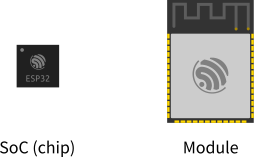

######
Boards
######

Development Boards
------------------

You will need a development board or a custom board with the ESP32 (see Supported SoC's) to start playing.
There is a bunch of different types and models widely available on the Internet. You need to choose one that covers all your requirements.

To help you on this selection, we point out some facts about choosing the proper boardsto help you to save money and time.

**One ESP32 to rule them all!**

One important information that usually bring about some confusion is regarding the different models of the ESP32 SoC and modules.

The ESP32 is divided by family:

* ESP32
    * Wi-Fi and BLE
* ESP32-S
    * Wi-Fi only
* ESP32-C
    * Wi-Fi and BLE 5

For each family, we have SoC variants with some differentiation. The differences are more about the embedded flash and its size and the number of the cores (dual or single).

The modules use the SoC internally, including the external flash, PSRAM (in some models) and other essential electronic components. Essentially, all
modules from the same family use the same SoC.

**For example:**

The SoC partnumber is the ESP32-D0WD-V3 and it's the same SoC used inside of the ESP32-WROVER (with PSRAM) and ESP32-WROOM modules. This means that the
same characteristics are present in both modules' core.

For more detailed information regarding the SoC's and modules, see the `Espressif Product Selector`_.

Now that you know that the module can be different but the heart is the same, you can choose your development board.

Before buying: Keep in mind that for some "must have" features when choosing the best board for your needs:

- Embedded USB-to-Serial
    - This is very convenient for programming and monitoring the logs with the terminal via USB. 
- Breadboard friendly
    - If you are prototyping, this will be very useful to connect your board directly on the breadboard.
- open-source/open-hardware
    - Check if the schematics are available for download. This helps a lot on prototyping.
- Support
    - Some of the manufacturers offer a very good level of support, with examples and demo projects.

Espressif
---------

.. toctree::
    :maxdepth: 1

    ESP32-DevKitC <ESP32-DevKitC-1>
    ESP32-S2-Saola-1 <ESP32-S2-Saola-1>
    ESP32-C3-DevKitM-1 <ESP32-C3-DevKitM-1>

Third Party
-----------

Add here the third party boards, listed by vendors.

.. note::
    All the information must be provided by the vendor. If your favorite board is not here, consider
    creating an `issue on GitHub <https://github.com/espressif/arduino-esp32/issues>`_ and directly
    link/mention the vendor in the issue description.

LOLIN
*****

* |board_lolin_d32|
* |board_lolin_d32_pro|

Generic Vendor
**************
    
    .. toctree::
        :maxdepth: 1
    
        Generic Board Name <generic>
    
    .. note::
        Create one file per board or one file with multiple boards. Do not add board information/description on this file.

.. include:: ../common/datasheet.inc

Resources
---------

.. _Espressif Systems: https://www.espressif.com 
.. _Espressif Product Selector: https://products.espressif.com/

.. |board_lolin_d32| raw:: html

  <a href="https://www.wemos.cc/en/latest/d32/d32.html" target="_blank">LOLIN D32</a>

.. |board_lolin_d32_pro| raw:: html

  <a href="https://www.wemos.cc/en/latest/d32/d32_pro.html" target="_blank">LOLIN D32 Pro</a>