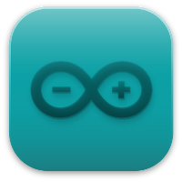

###############
Getting Started
###############

About Arduino ESP32
-------------------

Welcome to the Arduino ESP32 support documentation! Here you will find important information on how to use the project.

First Things First
------------------

.. note::
    Before continuing, we must be clear that this project is supported by `Espressif Systems`_ and the community.
    Everyone is more than welcome to contribute back to this project.

ESP32 is a single 2.4 GHz Wi-Fi-and-Bluetooth SoC (System On a Chip) designed by `Espressif Systems`_.

ESP32 is designed for mobile, wearable electronics, and Internet-of-Things (IoT) applications. It features all the state-of-the-art characteristics
of low-power chips, including fine-grained clock gating, multiple power modes,and dynamic power scaling. For instance, in a low-power IoT sensor
hub application scenario, ESP32 is woken-up periodically and only when a specified condition is detected. Low-duty cycle is used to minimize the
amount of energy that the chip expends.

The output of the power amplifier is also adjustable, thus contributing to an optimal trade-off between communication range, data rate and
power consumption.

The ESP32 series is available as a chip or module.

.. _supported_socs:

Supported SoC's
---------------

Here are the ESP32 series supported by the Arduino-ESP32 project:

========== ====== =========== =================================
SoC        Stable Development Datasheet
========== ====== =========== =================================
ESP32      Yes    Yes         `ESP32`_
ESP32-S2   Yes    Yes         `ESP32-S2`_
ESP32-C3   Yes    Yes         `ESP32-C3`_
ESP32-S3   Yes    Yes         `ESP32-S3`_
ESP32-C6   Yes    Yes         `ESP32-C6`_
ESP32-H2   Yes    Yes         `ESP32-H2`_
========== ====== =========== =================================

.. note::
    ESP32-C2 is also supported by Arduino-ESP32 but requires rebuilding the static libraries.
    This is not trivial and requires a good understanding of the ESP-IDF build system.
    For more information, see the `Lib Builder documentation <lib_builder.html>`_.

See `Boards <boards/boards.html>`_ for more details about ESP32 development boards.

Arduino Core Reference
----------------------

This documentation is built on the ESP32 and we are not going to cover the common Arduino API. To see the Arduino reference documentation,
please consider reading the official documentation.

Arduino Official Documentation: `Arduino Reference`_.

Supported Operating Systems
---------------------------

+-------------------+-------------------+-------------------+
| |windows-logo|    | |linux-logo|      | |macOS-logo|      |
+-------------------+-------------------+-------------------+
| Windows           | Linux             | macOS             |
+-------------------+-------------------+-------------------+

.. |windows-logo| image:: ../_static/logo_windows.png
.. |linux-logo| image:: ../_static/logo_linux.png
.. |macOS-logo| image:: ../_static/logo_macos.png

Supported IDEs
---------------------------

Here is the list of supported IDE for Arduino ESP32 support integration.

+-------------------+-------------------+
| |arduino-logo|    | |pio-logo|        |
+-------------------+-------------------+
| Arduino IDE       | PlatformIO        |
+-------------------+-------------------+

See `Installing Guides <installing.html>`_ for more details on how to install the Arduino ESP32 support.

Support
-------

This is an open project and it's supported by the community. Fell free to ask for help in one of the community channels.

Community
---------

The Arduino community is huge! You can find a lot of useful content on the Internet.
Here are some community channels where you may find information and ask for some help, if needed.

- `ESP32 Forum`_: Official Espressif Forum.
- `ESP32 Forum - Arduino`_: Official Espressif Forum for Arduino related discussions.
- `ESP32 Forum - Hardware`_: Official Espressif Forum for Hardware related discussions.
- `Gitter`_
- `Espressif MCUs (Discord)`_
- `ESP32 on Reddit`_

Issues Reporting
----------------

Before opening a new issue, please read this:

Be sure to search for a similar reported issue. This avoids duplicating or creating noise in the GitHub Issues reporting.
We also have the troubleshooting guide to save your time on the most common issues reported by users.

For more details about creating new Issue, see the `Issue Template <https://github.com/espressif/arduino-esp32/blob/master/.github/ISSUE_TEMPLATE/Issue-report.yml>`_.

If you have any new idea, see the `Feature request Template <https://github.com/espressif/arduino-esp32/blob/master/.github/ISSUE_TEMPLATE/Feature-request.yml>`_.

First Steps
-----------

Here are the first steps to get the Arduino ESP32 support running.

To install Arduino-ESP32, please see the dedicated section on the Installation guide. We recommend you install it using the boards manager.

.. toctree::
    :maxdepth: 2

    How to Install <installing>
    Development Boards <boards/boards>

Examples
--------

After installing the toolchain into your environment, you will be able to see all the dedicated examples for the ESP32. These examples are located
in the examples menu or inside each library folder.

    https://github.com/espressif/arduino-esp32/tree/master/libraries

There is also a `list of examples <https://techtutorialsx.com/category/esp32/>`_ managed outside of Espressif, so check them out.

.. include:: common/datasheet.inc

Resources
---------

.. _Espressif Systems: https://www.espressif.com
.. _Espressif Product Selector: https://products.espressif.com/
.. _Arduino.cc: https://www.arduino.cc/en/Main/Software
.. _Arduino Reference: https://www.arduino.cc/reference/en/
.. _ESP32 Forum: https://esp32.com
.. _ESP32 Forum - Arduino: https://esp32.com/viewforum.php?f=19
.. _ESP32 Forum - Hardware: https://esp32.com/viewforum.php?f=12
.. _Gitter: https://gitter.im/espressif/arduino-esp32
.. _Adafruit (Discord): https://discord.gg/adafruit
.. _Espressif MCUs (Discord): https://discord.gg/nKxMTnkD
.. _ESP32 on Reddit: https://www.reddit.com/r/esp32
