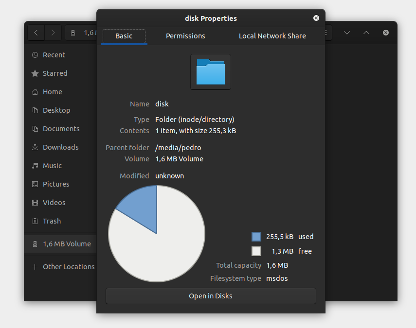

######################
Arduino IDE Tools Menu
######################

Introduction
------------

This guide is a walkthrough of the Arduino IDE configuration menu for the ESP32 System on Chip (SoC's). In this guide, you will see the most relevant configuration
to get your project optimized and working.

Since some boards and SoC's may vary in terms of hardware configuration, be sure you know all the board characteristics that you are using, like flash memory size, SoC variant (ESP32 family), PSRAM, etc.

.. note:: To help you identify the characteristics, you can see the `Espressif Product Selector`_.

Arduino IDE
-----------

The Arduino IDE is widely used for ESP32 on Arduino development and offers a wide variety of configurations.

Tools Menu
----------

To properly configure your project build and flash, some settings must be done in order to get it compiled and flashed without any issues.
Some boards are natively supported and almost no configuration is required. However, if your is not yet supported or you have a custom board, you need to configure the environment by yourself.

For more details or to add a new board, see the `boards.txt`_ file.

Generic Options
---------------

Most of the options are available for every ESP32 family. Some options will be available only for specific targets, like the USB configuration.

Board
*****

This option is the target board and must be selected in order to get all the default configuration settings. Once you select the correct board, you will see that some configurations will be automatically selected, but be aware that some boards can have multiple versions (i.e different flash sizes).

To select the board, go to ``Tools -> Board -> ESP32 Arduino`` and select the target board.

If your board is not present on this list, you can select the generic ``ESP32-XX Dev Module``.

Currently, we have one generic development module for each of the supported targets.

If the board selected belongs to another SoC family, you will see the following information at the build output:

    ``A fatal error occurred: This chip is ESP32 not ESP32-S2. Wrong --chip argument?``

Upload Speed
************

To select the flashing speed, change the ``Tools -> Upload Speed``. This value will be used for flashing the code to the device.

.. note:: If you have issues while flashing the device at high speed, try to decrease this value. This could be due to the external serial-to-USB chip limitations.

CPU Frequency
*************

On this option, you can select the CPU clock frequency. This option is critical and must be selected according to the high-frequency crystal present on the board and the radio usage (Wi-Fi and Bluetooth).

In some applications, reducing the CPU clock frequency is recommended in order to reduce power consumption.

If you don't know why you should change this frequency, leave the default option.

Flash Frequency
***************

Use this function to select the flash memory frequency. The frequency will be dependent on the memory model.

* **40 MHz**
* **80 MHz**

If you don't know if your memory supports **80 MHz**, you can try to upload the sketch using the **80 MHz** option and watch the log output via the serial monitor.

.. note:: In some boards/SoC, the flash frequency is automatically selected according to the flash mode. In some cases (i.e ESP32-S3), the flash frequency is up to 120 MHz.

Flash Mode
**********

This option is used to select the SPI communication mode with the flash memory.

Depending on the application, this mode can be changed in order to increase the flash communication speed.

* **QIO** - Quad I/O Fast Read
    * Four SPI pins are used to write to the flash and to read from the flash.

* **DIO** - Dual I/O Fast Read
    * Two SPI pins are used to write to the flash and to read from the flash.

* **QOUT** - Quad Output Fast Read
    * Four SPI pins are used to read the flash data.

* **DOUT** - Dual Output Fast Read
    * Two SPI pins are used to read flash data.

* **OPI** - Octal I/O
    * Eight SPI pins are used to write and to read from the flash.

If you don't know how the board flash is physically connected or the flash memory model, try the **QIO** at **80 MHz** first.

Flash Size
**********

This option is used to select the flash size. The flash size should be selected according to the flash model used on your board.

* **2 MB** (16 Mb)
* **4 MB** (32 Mb)
* **8 MB** (64 Mb)
* **16 MB** (128 Mb)

If you choose the wrong size, you may have issues when selecting the partition scheme.

Embedded Flash
^^^^^^^^^^^^^^

Some SoC has embedded flash. The ESP32-S3 is a good example.

.. note:: Check the manufacturer part number of your SoC/module to see the right version.

Example: **ESP32-S3FH4R2**

This particular ESP32-S3 variant comes with 4 MB Flash and 2 MB PSRAM.

**Options for Embedded Flash**

* **Fx4** 4 MB Flash (*QIO*)
* **Fx8** 8 MB Flash (*QIO*)
* **V** 1.8 V SPI

The **x** stands for the temperature range specification.

* **H** High Temperature (*-40 to 85ºC*)
* **N** Low Temperature (*-40 to 65ºC*)

For more details, please see the corresponding datasheet at `Espressif Product Selector`_.

Partition Scheme
****************

This option is used to select the partition model according to the flash size and the resources needed, like storage area and OTA (Over The Air updates).

.. note:: Be careful selecting the right partition according to the flash size. If you select the wrong partition, the system will crash.

Core Debug Level
****************

This option is used to select the Arduino core debugging level to be printed to the serial debug.

* **None** - Prints nothing.
* **Error** - Only at error level.
* **Warning** - Only at warning level and above.
* **Info** - Only at info level and above.
* **Debug** - Only at debug level and above.
* **Verbose** - Prints everything.

PSRAM
*****

The PSRAM is an internal or external extended RAM present on some boards, modules or SoC.

This option can be used to ``Enable`` or ``Disable`` PSRAM. In some SoCs, you can select the PSRAM mode as the following.

* **QSPI PSRAM** - Quad PSRAM
* **OPI PSRAM** - Octal PSRAM

Embedded PSRAM
^^^^^^^^^^^^^^

Some SoC has embedded PSRAM. The ESP32-S3 is a good example.

Example: **ESP32-S3FH4R2**

This particular ESP32-S3 comes with 4 MB Flash and 2 MB PSRAM.

**Options for Embedded Flash and PSRAM**

* **R2** 2 MB PSRAM (*QSPI*)
* **R8** 8 MB PSRAM (*OPI*)
* **V** 1.8 V SPI

The **x** stands for the temperature range specification.

* **H** High Temperature (*-40 to 85ºC*)
* **N** Low Temperature (*-40 to 65ºC*)

For more details, please see the corresponding datasheet at `Espressif Product Selector`_.

Arduino Runs On
***************

This function is used to select the core that runs the Arduino core. This is only valid if the target SoC has 2 cores.

When you have some heavy task running, you might want to run this task on a different core than the Arduino tasks. For this reason, you have this configuration to select the right core.

Events Run On
*************

This function is also used to select the core that runs the Arduino events. This is only valid if the target SoC has 2 cores.

Erase All Flash Before Sketch Upload
************************************

This option selects the flash memory region to be erased before uploading the new sketch.

* **Disabled** - Upload the sketch without erasing all flash contents. (Default)
* **Enabled** - Erase all flash contents before uploading the sketch.

Port
****

This option is used to select the serial port to be used on the flashing and monitor.

USB Options
-----------

Some ESP32 families have a USB peripheral. This peripheral can be used for flashing and debugging.

To see the supported list for each SoC, see this section: `Libraries <../libraries.html>`_.

The USB option will be available only if the correct target is selected.

USB CDC On Boot
***************

The USB Communications Device Class, or USB CDC, is a class used for basic communication to be used as a regular serial controller (like RS-232).

This class is used for flashing the device without any other external device attached to the SoC.

This option can be used to ``Enable`` or ``Disable`` this function at the boot. If this option is ``Enabled``, once the device is connected via USB, one new serial port will appear in the list of the serial ports.
Use this new serial port for flashing the device.

This option can be used as well for debugging via the ``Serial Monitor`` using **CDC** instead of the **UART0**.

To use the UART as serial output, you can use ``Serial0.print("Hello World!");`` instead of ``Serial.print("Hello World!");`` which will be printed using USB CDC.

USB Firmware MSC On Boot
************************

The USB Mass Storage Class, or USB MSC, is a class used for storage devices, like a USB flash drive.

This option can be used to ``Enable`` or ``Disable`` this function at the boot. If this option is ``Enabled``, once the device is connected via USB, one new storage device will appear in the system as a storage drive.
Use this new storage drive to write and read files or to drop a new firmware binary to flash the device.

USB DFU On Boot
***************

The USB Device Firmware Upgrade is a class used for flashing the device through USB.

This option can be used to ``Enable`` or ``Disable`` this function at the boot. If this option is ``Enabled``, once the device is connected via USB, the device will appear as a USB DFU capable device.

.. _Espressif Product Selector: https://products.espressif.com/
.. _boards.txt: https://github.com/espressif/arduino-esp32/blob/master/boards.txt
