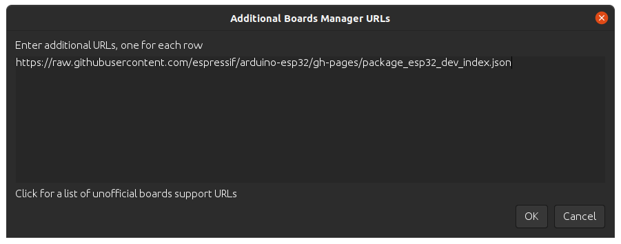

##########
Installing
##########

This guide will show how to install the Arduino-ESP32 support.

Before Installing
-----------------

We recommend you install the support using your favorite IDE, but other options are available depending on your operating system.
To install Arduino-ESP32 support, you can use one of the following options.

Installing using Arduino IDE
----------------------------

.. figure:: ../_static/logo_arduino.png
   :align: center
   :width: 200
   :figclass: align-center

This is the way to install Arduino-ESP32 directly from the Arduino IDE.

.. note::
   For overview of SoC's support, take a look on `Supported Soc's table <https://docs.espressif.com/projects/arduino-esp32/en/latest/getting_started.html#supported-soc-s>`_ where you can find if the particular chip is under stable or development release.

- Stable release link::

   https://espressif.github.io/arduino-esp32/package_esp32_index.json

- Development release link::

   https://espressif.github.io/arduino-esp32/package_esp32_dev_index.json


.. note::
   Starting with the Arduino IDE version 1.6.4, Arduino allows installation of third-party platform
   packages using Boards Manager. We have packages available for Windows, macOS, and Linux.

To start the installation process using the Boards Managaer, follow these steps:

-  Install the current upstream Arduino IDE at the 1.8 level or later. The current version is at the `arduino.cc`_ website.

-  Start Arduino and open the Preferences window.

.. figure:: ../_static/install_guide_preferences.png
   :align: center
   :width: 600
   :figclass: align-center

-  Enter one of the release links above into *Additional Board Manager URLs* field. You can add multiple URLs, separating them with commas.



-  Open Boards Manager from Tools > Board menu and install *esp32* platform (and do not forget to select your ESP32 board from Tools > Board menu after installation).


- Restart Arduino IDE.

Installing using PlatformIO
---------------------------

.. figure:: ../_static/logo_pio.png
   :align: center
   :width: 200
   :figclass: align-center

PlatformIO is a professional collaborative platform for embedded development. It has out-of-the-box support for ESP32 SoCs and allows working with Arduino ESP32 as well as ESP-IDF from Espressif without changing your development environment. PlatformIO includes lots of instruments for the most common development tasks such as debugging, unit testing, and static code analysis.

.. warning:: Integration of the Arduino Core ESP32 project in PlatformIO is maintained by PlatformIO developers. Arduino Core ESP32 Project Team cannot support PlatformIO-specific issues. Please report these issues in official `PlatformIO repositories <https://github.com/platformio>`_.

A detailed overview of the PlatformIO ecosystem and its philosophy can be found in `the official documentation <https://docs.platformio.org/en/latest/core/index.html>`_.

PlatformIO can be used in two flavors:

- `PlatformIO IDE <https://platformio.org/platformio-ide>`_ is a toolset for embedded C/C++ development available on Windows, macOS and Linux platforms

- `PlatformIO Core (CLI) <https://docs.platformio.org/en/latest/core/index.html>`_ is a command-line tool that consists of a multi-platform build system, platform and library managers and other integration components. It can be used with a variety of code development environments and allows integration with cloud platforms and web services

To install PlatformIO, you can follow this Getting Started, provided at `docs.platformio.org`_.

Using the stable code
*********************

.. note::
   A detailed overview of supported development boards, examples and frameworks can be found on `the official Espressif32 dev-platform page <https://registry.platformio.org/platforms/platformio/espressif32>`_ in the PlatformIO Registry.

The most reliable and easiest way to get started is to use the latest stable version of the ESP32 development platform that passed all tests/verifications and can be used in production.

Create a new project and select one of the available boards. You can change after by changing the `platformio.ini <https://docs.platformio.org/en/latest/projectconf/index.html>`_ file.

- For ESP32

.. code-block:: bash

   [env:esp32dev]
   platform = espressif32
   board = esp32dev
   framework = arduino

- For ESP32-S2 (ESP32-S2-Saola-1 board)

.. code-block:: bash

   [env:esp32-s2-saola-1]
   platform = espressif32
   board = esp32-s2-saola-1
   framework = arduino

- For ESP32-C3 (ESP32-C3-DevKitM-1 board)

.. code-block:: bash

   [env:esp32-c3-devkitm-1]
   platform = espressif32
   board = esp32-c3-devkitm-1
   framework = arduino

How to update to the latest code
********************************

To test the latest Arduino ESP32, you need to change your project *platformio.ini* accordingly.
The following configuration uses the upstream version of the Espressif development platform and the latest Arduino core directly from the Espressif GitHub repository:

.. code-block:: bash

   [env:esp32-c3-devkitm-1]
   platform = https://github.com/platformio/platform-espressif32.git
   board = esp32-c3-devkitm-1
   framework = arduino
   platform_packages =
       framework-arduinoespressif32 @ https://github.com/espressif/arduino-esp32#master


To get more information about PlatformIO, see the following links:

- `PlatformIO Core (CLI) <https://docs.platformio.org/en/latest/core/index.html>`_

- `PlatformIO Home <https://docs.platformio.org/en/latest/home/index.html>`_

- `Tutorials and Examples <https://docs.platformio.org/en/latest/tutorials/index.html>`_

- `Library Management <https://docs.platformio.org/en/latest/librarymanager/index.html>`_


Windows (manual installation)
-----------------------------

.. warning:: Arduino ESP32 core v2.x.x cannot be used on Windows 8.x x86 (32 bits), Windows 7 or earlier. The Windows 32 bits OS is no longer supported by this toolchain.

   The Arduino ESP32 v1.0.6 still works on WIN32. You might want to install python 3.8.x because it is the latest release supported by Windows 7.

Steps to install Arduino ESP32 support on Windows:

**Step 1**

1. Download and install the latest Arduino IDE ``Windows Installer`` from [arduino.cc](https://www.arduino.cc/en/Main/Software)
2. Download and install Git from [git-scm.com](https://git-scm.com/download/win)
3. Start ``Git GUI`` and do the following steps:

- Select ``Clone Existing Repository``


- Select source and destination
   - Sketchbook Directory: Usually ``C:/Users/[YOUR_USER_NAME]/Documents/Arduino`` and is listed underneath the "Sketchbook location" in Arduino preferences.
   - Source Location: ``https://github.com/espressif/arduino-esp32.git``
   - Target Directory: ``[ARDUINO_SKETCHBOOK_DIR]/hardware/espressif/esp32``
   - Click ``Clone`` to start cloning the repository

**Step 2**


**Step 3**


- open a `Git Bash` session pointing to ``[ARDUINO_SKETCHBOOK_DIR]/hardware/espressif/esp32`` and execute ```git submodule update --init --recursive```
- Open ``[ARDUINO_SKETCHBOOK_DIR]/hardware/espressif/esp32/tools`` and double-click ``get.exe``

**Step 4**

.. figure:: ../_static/win-gui-4.png
   :align: center
   :figclass: align-center

- When ```get.exe``` finishes, you should see the following files in the directory

**Step 5**


1. Plug your ESP32 board and wait for the drivers to install (or install manually any that might be required)
2. Start Arduino IDE
3. Select your board in ``Tools > Board`` menu
4. Select the COM port that the board is attached to
5. Compile and upload (You might need to hold the boot button while uploading)


How to update to the latest code
********************************

1. Start ``Git GUI`` and you should see the repository under ``Open Recent Repository``. Click on it!


1. From menu ``Remote`` select ``Fetch from`` > ``origin``


1. Wait for git to pull any changes and close ``Git GUI``
2. Open ``[ARDUINO_SKETCHBOOK_DIR]/hardware/espressif/esp32/tools`` and double-click ``get.exe``

.. figure:: ../_static/win-gui-4.png
   :align: center
   :figclass: align-center

Linux
-----

.. figure:: ../_static/logo_linux.png
   :align: center
   :width: 200
   :figclass: align-center

Debian/Ubuntu
*************

- Install latest Arduino IDE from `arduino.cc`_.

- Open Terminal and execute the following command (copy -> paste and hit enter):

.. code-block:: bash

   sudo usermod -a -G dialout $USER && \
   sudo apt-get install git && \
   wget https://bootstrap.pypa.io/get-pip.py && \
   sudo python3 get-pip.py && \
   sudo pip3 install pyserial && \
   mkdir -p ~/Arduino/hardware/espressif && \
   cd ~/Arduino/hardware/espressif && \
   git clone https://github.com/espressif/arduino-esp32.git esp32 && \
   cd esp32/tools && \
   python3 get.py

- Restart Arduino IDE.

- If you have Arduino installed to ~/, modify the installation as follows, beginning at `mkdir -p ~/Arduino/hardware`:

.. code-block:: bash

   cd ~/Arduino/hardware
   mkdir -p espressif && \
   cd espressif && \
   git clone https://github.com/espressif/arduino-esp32.git esp32 && \
   cd esp32/tools && \
   python3 get.py

Fedora
******

- Install the latest Arduino IDE from `arduino.cc`_.

.. note::
   Command ``$ sudo dnf -y install arduino`` will most likely install an older release.

- Open Terminal and execute the following command (copy -> paste and hit enter):

.. code-block:: bash

   sudo usermod -a -G dialout $USER && \
   sudo dnf install git python3-pip python3-pyserial && \
   mkdir -p ~/Arduino/hardware/espressif && \
   cd ~/Arduino/hardware/espressif && \
   git clone https://github.com/espressif/arduino-esp32.git esp32 && \
   cd esp32/tools && \
   python get.py

- Restart Arduino IDE.

openSUSE
********

- Install the latest Arduino IDE from `arduino.cc`_.

- Open Terminal and execute the following command (copy -> paste and hit enter):

.. code-block:: bash

   sudo usermod -a -G dialout $USER && \
   if [ `python --version 2>&1 | grep '2.7' | wc -l` = "1" ]; then \
   sudo zypper install git python-pip python-pyserial; \
   else \
   sudo zypper install git python3-pip python3-pyserial; \
   fi && \
   mkdir -p ~/Arduino/hardware/espressif && \
   cd ~/Arduino/hardware/espressif && \
   git clone https://github.com/espressif/arduino-esp32.git esp32 && \
   cd esp32/tools && \
   python get.py

- Restart Arduino IDE.

macOS
-----

- Install the latest Arduino IDE from `arduino.cc`_.

- Open Terminal and execute the following command (copy -> paste and hit enter):

.. code-block:: bash

   mkdir -p ~/Documents/Arduino/hardware/espressif && \
   cd ~/Documents/Arduino/hardware/espressif && \
   git clone https://github.com/espressif/arduino-esp32.git esp32 && \
   cd esp32/tools && \
   python get.py

Where ``~/Documents/Arduino`` represents your sketch book location as per "Arduino" > "Preferences" > "Sketchbook location" (in the IDE once started). Adjust the command above accordingly.

- If you get the error below, install through the command line dev tools with `xcode-select --install` and try the command above again:

.. code-block:: bash

   xcrun: error: invalid active developer path (/Library/Developer/CommandLineTools), missing xcrun at: /Library/Developer/CommandLineTools/usr/bin/xcrun

- Run the command:

.. code-block:: bash

   xcode-select --install

- Try ``python3`` instead of ``python`` if you get the error: ``IOError: [Errno socket error] [SSL: TLSV1_ALERT_PROTOCOL_VERSION] tlsv1 alert protocol version (_ssl.c:590)`` when running ``python get.py``

- If you get the following error when running ``python get.py`` urllib.error.URLError: <urlopen error SSL: CERTIFICATE_VERIFY_FAILED, go to Macintosh HD > Applications > Python3.6 folder (or any other python version), and run the following scripts: Install Certificates.command and Update Shell Profile.command

- Restart Arduino IDE.

.. _Arduino.cc: https://www.arduino.cc/en/Main/Software
.. _docs.platformio.org: https://docs.platformio.org/en/latest/integration/ide/pioide.html
