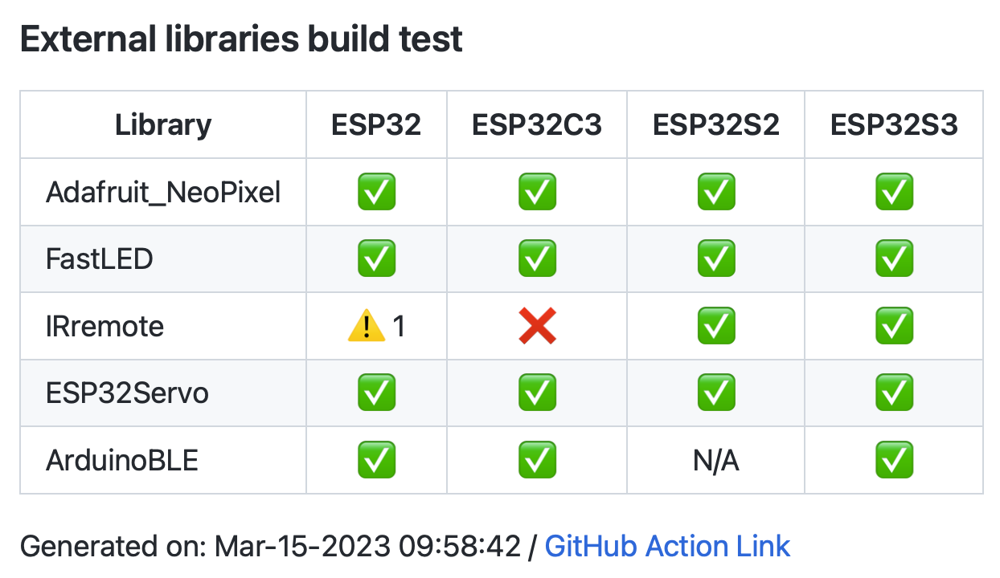
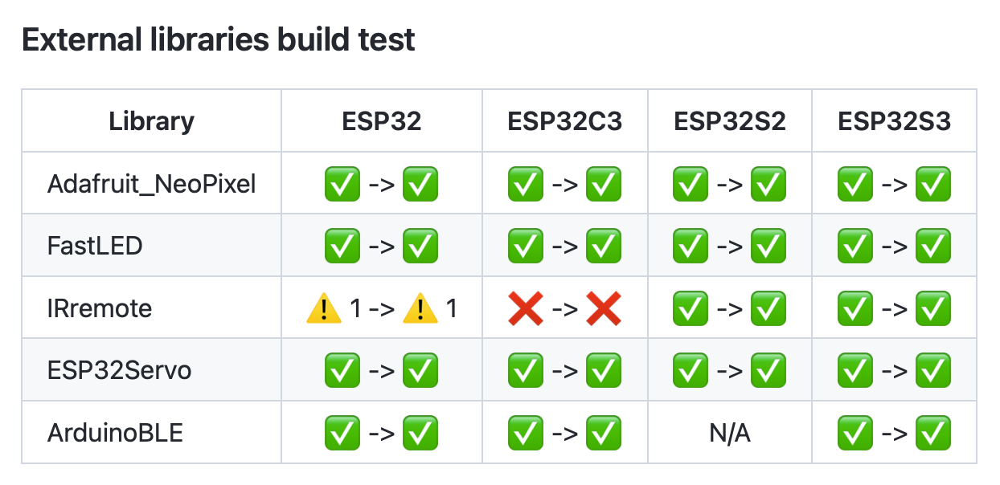

##########################
External Libraries Testing
##########################

About
-----

External libraries testing is a compilation test for listed libraries on arduino-esp32 master branch. The test was made for users, so they can check which libraries are compiling without errors on which SoC.
External libraries test is running periodicaly (once a week) agains master branch and can also run on PR by adding a label ``lib_test``.
The test is running on all supported ESP32 chips.

.. note:: 
  As the test is just a compilation of example, that does not guarrantee that the library/sketch will run without any problems after flashing it on your device.

How to Add Library to Test
--------------------------

.. note:: 
  Library must be listed in Arduino Library Manager. 
  If you want to add your library to the Arduino Library Manager see `Adding a library to library manager <https://github.com/arduino/library-registry#adding-a-library-to-library-manager>`_

Adding a library is divided to 2 categories:

1. Adding a library which can work on all chips (eg. all chips have support for the peripherals used)
2. Adding a chip specific library which cannot work on all chips (e.g. BLE / Ethernet peripheral is not supported by all chips)
   
For both categories only 2 simple steps are required to add a library to the test workflow file ``lib.yml``.
Workflow file is located in ``./github/workflows/lib.yml``.

Library uses peripheral which is has all chips
**********************************************

* Add new line with the library name to the list of ``UNIVERSAL_LIBRARIES`` in ``lib.yml`` file:
   
  .. code-block:: yaml

    # Libraries list to be installed
    UNIVERSAL_LIBRARIES: |
      - source-path: ./
      - name: Adafruit NeoPixel
      - name: FastLED
      - name: IRremote
      - name: ESP32Servo

* Add new line with the sketch path to the list of ``UNIVERSAL_SKETCHES`` in ``lib.yml`` file (sketch needs to be from the examples of the library):
   
  .. code-block:: yaml

    # List of sketches to build (1 for each library)
    UNIVERSAL_SKETCHES: 
      ~/Arduino/libraries/Adafruit_NeoPixel/examples/strandtest/strandtest.ino
      ~/Arduino/libraries/FastLED/examples/Blink/Blink.ino
      ~/Arduino/libraries/IRremote/examples/SendDemo/SendDemo.ino
      ~/Arduino/libraries/ESP32Servo/examples/Knob/Knob.ino

Library uses peripheral specific to some chips
**********************************************

* Add new line with the library name to the list of ``additional-libraries`` under each SOC which supports the peripheral used by library in ``lib.yml`` file:
   
* Add new line with the sketch path to the list of ``additional-sketches`` under each SOC which supports the peripheral in ``lib.yml`` file 
   (sketch needs to be from the examples of the library):
   
  Example for adding ``ArduinoBLE`` library (ESP32-S2 dont have BLE peripheral)

  .. code-block:: yaml

    include:
      - fqbn: espressif:esp32:esp32
        additional-libraries: |
          - name: ArduinoBLE
        additional-sketches: |
          ~/Arduino/libraries/ArduinoBLE/examples/Central/Scan/Scan.ino
      - fqbn: espressif:esp32:esp32s2
        additional-libraries:
        additional-sketches:
      - fqbn: espressif:esp32:esp32c3
        additional-libraries: |
          - name: ArduinoBLE
        additional-sketches: |
          ~/Arduino/libraries/ArduinoBLE/examples/Central/Scan/Scan.ino
      - fqbn: espressif:esp32:esp32s3
        additional-libraries: |
          - name: ArduinoBLE
        additional-sketches: |
          ~/Arduino/libraries/ArduinoBLE/examples/Central/Scan/Scan.ino

Common part
***********

* Open a PR with the changes and someone from Espressif team will add a label ``lib_test`` to the PR and CI will run the test to check, if the addition is fine and library / example are compiling.

* After merging your PR, the next scheduled test will test your library and add the results to the `LIBRARIES_TEST.md`_.
  
Test Results
------------

Icons meaning
*************

* |success| - Compilation was successful.

* |warning| - Compilation was successful with some warnings. (number of warnings is printed next to the icon)

* |fail| - Compilation failed.

* ``N/A`` - Not tested.

Scheduled test result
*********************

You can check the results in `LIBRARIES_TEST.md`_.

The results file example:

Pull Request test result
************************

If the test run on Pull Request, it will compile all libraries and sketches 2 times (before/after changes in PR) to see, if the PR is breaking/fixing libraries.
In the table the results are in order ``BEFORE -> AFTER``.

.. |success| image:: _static/green_checkmark.png
   :height: 2ex
   :class: no-scaled-link

.. |warning| image:: _static/warning.png
   :height: 2ex
   :class: no-scaled-link

.. _LIBRARIES_TEST.md: https://github.com/espressif/arduino-esp32/LIBRARIES_TEST.md