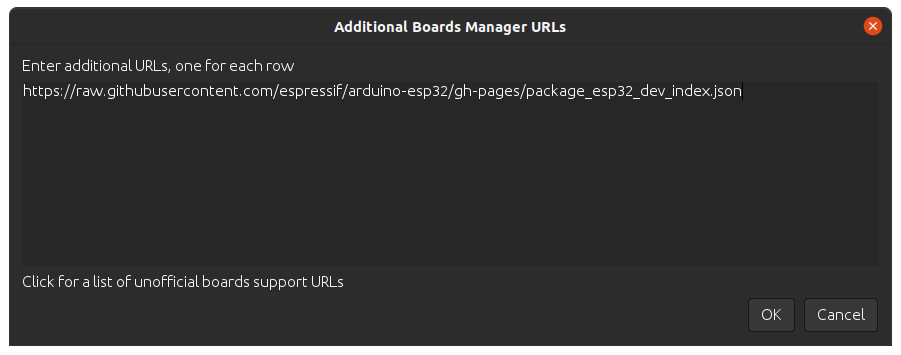
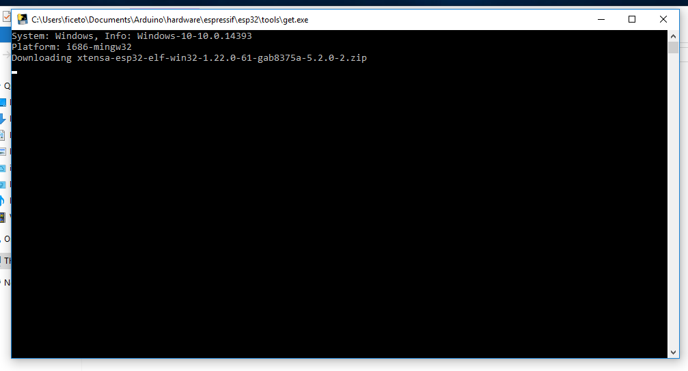
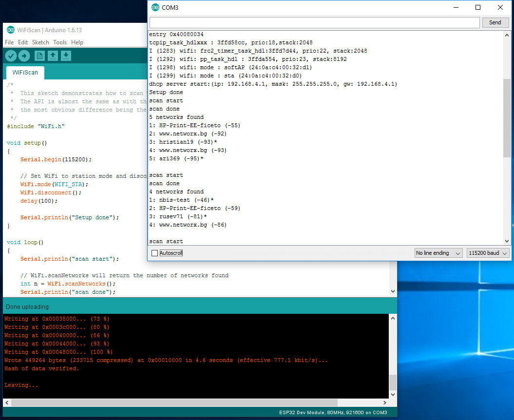
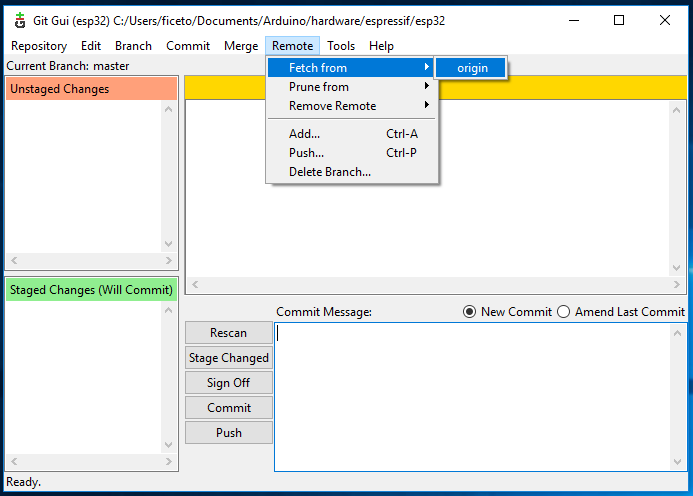

##########
Installing
##########

This guide will show how to install the Arduino-ESP32 support.

Before Installing
-----------------

We recommend you install the support using the Boards Manager, but other options are available depending on your operating system. 
To install Arduino-ESP32 support, you can use one of the following options.

Installing using Boards Manager
-------------------------------

This is the preferred and easiest way to install Arduino-ESP32.

.. note::
   Currently, the support for new chips (ESP32-S2 and ESP32-C3) is in the development release. Consider installing the development release if you need to test the new supported SoC in beta.

- Stable release link::

   https://raw.githubusercontent.com/espressif/arduino-esp32/gh-pages/package_esp32_index.json

- Development release link::

   https://raw.githubusercontent.com/espressif/arduino-esp32/gh-pages/package_esp32_dev_index.json


.. note::
   Starting with the Arduino IDE version 1.6.4, Arduino allows installation of third-party platform 
   packages using Boards Manager. We have packages available for Windows, macOS, and Linux (x86, amd64, armhf and arm64).

To start the installation process using the Boards Managaer, follow these steps:

-  Install the current upstream Arduino IDE at the 1.8 level or later. The current version is at the `arduino.cc`_ website.

-  Start Arduino and open the Preferences window.

.. figure:: _static/install_guide_preferences.png
   :align: center
   :width: 600
   :figclass: align-center

-  Enter one of the release links above into *Additional Board Manager URLs* field. You can add multiple URLs, separating them with commas.



-  Open Boards Manager from Tools > Board menu and install *esp32* platform (and do not forget to select your ESP32 board from Tools > Board menu after installation).

.. figure:: _static/install_guide_boards_manager_esp32.png
   :align: center
   :width: 600
   :figclass: align-center

- Restart Arduino IDE.

Windows
-------

Steps to install Arduino ESP32 support on Windows:

.. note::
   Tested on Windows 10 32 and 64 bit machines.

**Step 1**

1. Download and install the latest Arduino IDE ``Windows Installer`` from [arduino.cc](https://www.arduino.cc/en/Main/Software)
2. Download and install Git from [git-scm.com](https://git-scm.com/download/win)
3. Start ``Git GUI`` and do the following steps:

- Select ``Clone Existing Repository``

.. figure:: _static/win-gui-1.png
   :align: center
   :width: 600
   :figclass: align-center

- Select source and destination
   - Sketchbook Directory: Usually ``C:/Users/[YOUR_USER_NAME]/Documents/Arduino`` and is listed underneath the "Sketchbook location" in Arduino preferences.
   - Source Location: ``https://github.com/espressif/arduino-esp32.git``
   - Target Directory: ``[ARDUINO_SKETCHBOOK_DIR]/hardware/espressif/esp32``
   - Click ``Clone`` to start cloning the repository

**Step 2**

.. figure:: _static/win-gui-2.png
   :align: center
   :figclass: align-center

**Step 3**

.. figure:: _static/win-gui-3.png
   :align: center
   :figclass: align-center

- open a `Git Bash` session pointing to ``[ARDUINO_SKETCHBOOK_DIR]/hardware/espressif/esp32`` and execute ```git submodule update --init --recursive``` 
- Open ``[ARDUINO_SKETCHBOOK_DIR]/hardware/espressif/esp32/tools`` and double-click ``get.exe``

**Step 4**



- When ```get.exe``` finishes, you should see the following files in the directory

**Step 5**

.. figure:: _static/win-gui-5.png
   :align: center
   :figclass: align-center

1. Plug your ESP32 board and wait for the drivers to install (or install manually any that might be required)
2. Start Arduino IDE
3. Select your board in ``Tools > Board`` menu
4. Select the COM port that the board is attached to
5. Compile and upload (You might need to hold the boot button while uploading)



How to update to the latest code
********************************

1. Start ``Git GUI`` and you should see the repository under ``Open Recent Repository``. Click on it!

.. figure:: _static/win-gui-update-1.png
   :align: center
   :figclass: align-center

1. From menu ``Remote`` select ``Fetch from`` > ``origin``



1. Wait for git to pull any changes and close ``Git GUI``
2. Open ``[ARDUINO_SKETCHBOOK_DIR]/hardware/espressif/esp32/tools`` and double-click ``get.exe``


Linux
-----

Debian/Ubuntu
*************

- Install latest Arduino IDE from `arduino.cc`_.

- Open Terminal and execute the following command (copy -> paste and hit enter):

.. code-block:: bash

   sudo usermod -a -G dialout $USER && \
   sudo apt-get install git && \
   wget https://bootstrap.pypa.io/get-pip.py && \
   sudo python3 get-pip.py && \
   sudo pip3 install pyserial && \
   mkdir -p ~/Arduino/hardware/espressif && \
   cd ~/Arduino/hardware/espressif && \
   git clone https://github.com/espressif/arduino-esp32.git esp32 && \
   cd esp32 && \
   git submodule update --init --recursive && \
   cd tools && \
   python3 get.py

- Restart Arduino IDE.

- If you have Arduino installed to ~/, modify the installation as follows, beginning at `mkdir -p ~/Arduino/hardware`:

.. code-block:: bash

   cd ~/Arduino/hardware
   mkdir -p espressif && \
   cd espressif && \
   git clone https://github.com/espressif/arduino-esp32.git esp32 && \
   cd esp32 && \
   git submodule update --init --recursive && \
   cd tools && \
   python3 get.py

Fedora
******

- Install the latest Arduino IDE from `arduino.cc`_.

.. note::
   Command ``$ sudo dnf -y install arduino`` will most likely install an older release.

- Open Terminal and execute the following command (copy -> paste and hit enter):

.. code-block:: bash

   sudo usermod -a -G dialout $USER && \
   sudo dnf install git python3-pip python3-pyserial && \
   mkdir -p ~/Arduino/hardware/espressif && \
   cd ~/Arduino/hardware/espressif && \
   git clone https://github.com/espressif/arduino-esp32.git esp32 && \
   cd esp32 && \
   git submodule update --init --recursive && \
   cd tools && \
   python get.py

- Restart Arduino IDE.

openSUSE
********

- Install the latest Arduino IDE from `arduino.cc`_.

- Open Terminal and execute the following command (copy -> paste and hit enter):

.. code-block:: bash

   sudo usermod -a -G dialout $USER && \
   if [ `python --version 2>&1 | grep '2.7' | wc -l` = "1" ]; then \
   sudo zypper install git python-pip python-pyserial; \
   else \
   sudo zypper install git python3-pip python3-pyserial; \
   fi && \
   mkdir -p ~/Arduino/hardware/espressif && \
   cd ~/Arduino/hardware/espressif && \
   git clone https://github.com/espressif/arduino-esp32.git esp32 && \
   cd esp32 && \
   git submodule update --init --recursive && \
   cd tools && \
   python get.py

- Restart Arduino IDE.

macOS
-----

- Install the latest Arduino IDE from `arduino.cc`_.

- Open Terminal and execute the following command (copy -> paste and hit enter):

.. code-block:: bash

   mkdir -p ~/Documents/Arduino/hardware/espressif && \
   cd ~/Documents/Arduino/hardware/espressif && \
   git clone https://github.com/espressif/arduino-esp32.git esp32 --depth 1 && \
   cd esp32 && \
   git submodule update --init --recursive --depth 1 && \
   cd tools && \
   python get.py 

Where ``~/Documents/Arduino`` represents your sketch book location as per "Arduino" > "Preferences" > "Sketchbook location" (in the IDE once started). Adjust the command above accordingly.

- If you get the error below, install through the command line dev tools with `xcode-select --install` and try the command above again:

.. code-block:: bash

   xcrun: error: invalid active developer path (/Library/Developer/CommandLineTools), missing xcrun at: /Library/Developer/CommandLineTools/usr/bin/xcrun

- Run the command:

.. code-block:: bash

   xcode-select --install

- Try ``python3`` instead of ``python`` if you get the error: ``IOError: [Errno socket error] [SSL: TLSV1_ALERT_PROTOCOL_VERSION] tlsv1 alert protocol version (_ssl.c:590)`` when running ``python get.py``

- If you get the following error when running ``python get.py`` urllib.error.URLError: <urlopen error SSL: CERTIFICATE_VERIFY_FAILED, go to Macintosh HD > Applications > Python3.6 folder (or any other python version), and run the following scripts: Install Certificates.command and Update Shell Profile.command

- Restart Arduino IDE.

PlatformIO
----------

- `What is PlatformIO? <https://docs.platformio.org/en/latest/what-is-platformio.html?utm_source=github&utm_medium=arduino-esp32>`_

- `PlatformIO IDE <https://platformio.org/platformio-ide?utm_source=github&utm_medium=arduino-esp32>`_

- `PlatformIO Core <https://docs.platformio.org/en/latest/core.html?utm_source=github&utm_medium=arduino-esp32>`_

- `Advanced usage <https://docs.platformio.org/en/latest/platforms/espressif32.html?utm_source=github&utm_medium=arduino-esp32>`_: Custom settings, uploading to SPIFFS, Over-the-Air (OTA), staging version

- `Integration with Cloud and Standalone IDEs <https://docs.platformio.org/en/latest/ide.html?utm_source=github&utm_medium=arduino-esp32>`_: Cloud9, Codeanywhere, Eclipse Che (Codenvy), Atom, CLion, Eclipse, Emacs, NetBeans, Qt Creator, Sublime Text, VIM, Visual Studio, and VSCode

- `Project Examples <https://docs.platformio.org/en/latest/platforms/espressif32.html?utm_source=github&utm_medium=arduino-esp32#examples>`_


.. _Arduino.cc: https://www.arduino.cc/en/Main/Software
